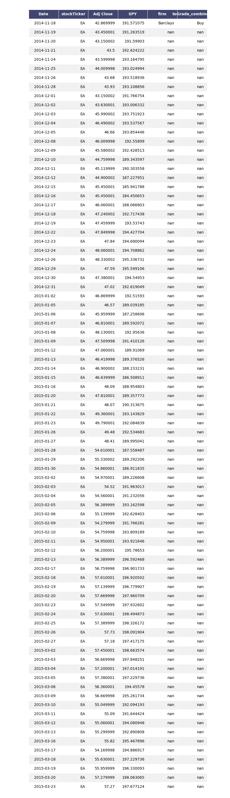

## Stock Analyst Upgrade Downgrade History

### Install

* requires 'pip' 

```
pip install pandas
pip install pandas-datareader
-m pip install matplotlib
-m pip install requests
pip install tqdm
```

## Introduction

I have always been interested in stock market trends, and have been wondering if certain influencial factors contribute to whether a stock goes up or down. One of these factors that I was curious about is whether large financial enterprises have market predicting abilities through their upgrading and downgrading of stocks. In order to do this, I decided to utilize the yahoo finance platform, and scrape each stock tickers webpage for the embedded JSON dictionary that contains the upgrade and downgrade data of the S&P 500 stocks.

In this release, I've created a code that separates each upgrade and downgrade into 5 different types of grades: Strong Buy, Buy, Hold, Sell, and Underperform. It then searches the stock value at the date of upgrading and downgrading and creates a chart of 90 following business days and compares it to the trend of the S&P 500 and adds each of these 90 day instances into the respective folder of the financial institution, then the type of grade. 

Example dataframe:




This project combines stock analyst firms upgrade and downgrade data of the s&p500 tickers, and compares the results with future stock price data. Its current executable, 'Loaded_Databases.ipynb, when ran with its instructions, can do analysis on the success rates of the analysts compared to what happened.

This program is scripted in Python, involves webscraping Yahoo Finance analyst lxml, creates Pandas Dataframes, and writes the dataframes into multiple CSV files.

## Future Scope

My next steps will be to see which stock analyst overall performs "best". "Best" is a very relative term so I will be using multiple statistical metrics to analyse. Then, I plan on creating multiple visualizations that would describe why any particular analyst is better than another. After that, I would like to do a stock ticker by stock ticker rundown of which of the analyst perform better for the particular stock.

There are a lot of different kinds of analysis that I can come up with, but if anyone has any particular statistical methodology that would provide an interesting analysis, I would greatly appreciate it.

### Description stock_upgradedowngradeHistory.ipynb

* the database is already created within the folder databases, it isn't important to run this code. This is just a reference of methodology.

* stock_upgradedowngradeHistory: Code used to scrape, clean, and combine data into relevant dataframes.
* Webscraped Yahoo Finance stock analyst data using BeautifulSoup4 and JSON
* Python Pandas to combine JSON objects into DataFrames
* Joined Upgrade Downgrade data with stock ticker historical data
* Combined grading terms into 5 different terms: Strong Buy, Buy, Hold, Sell, and Underperform
* added 1 day before, 1 day after, 30 days after, 60 days after, and 90 days after dates, prices, and percent changed from Open

* returned final dataframe with following columns

[['stockTicker',
 'Date',
 'Open',
 'Close',
 'Volume',
 'firm',
 'action',
 'fromGrade',
 'fromGrade_combined',          
 'toGrade',
 'toGrade_combined',
 '1_day_before_grade_Date',
 '1_day_before_grade_Date_Price',
 'percent1Before',
 '1_day_from_grade_Date',
 '1_day_from_grade_Date_Price',
 'percent1After',
 '30_days_from_grade_Date',
 '30_days_from_grade_Date_Price',
 'percent30',
 '60_days_from_grade_Date',
 '60_days_from_grade_Date_Price',
 'percent60',
 '90_days_from_grade_Date',
 '90_days_from_grade_Date_Price',
 'percent90']]


### Description: Loaded_Databases.ipynb

* This is the code to run for analysis
* Open with Jupyter Notebook
* Opens from the database folder, snp500merged and securities.csv (securities.csv retrieved from https://www.kaggle.com/dgawlik/nyse )
* run each cell


